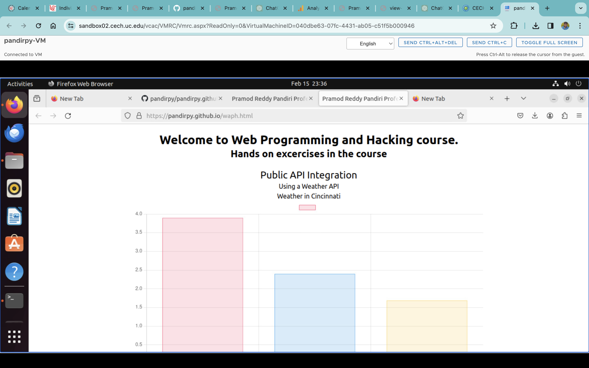
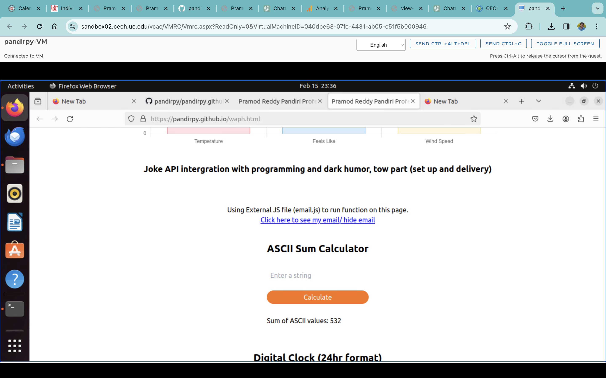
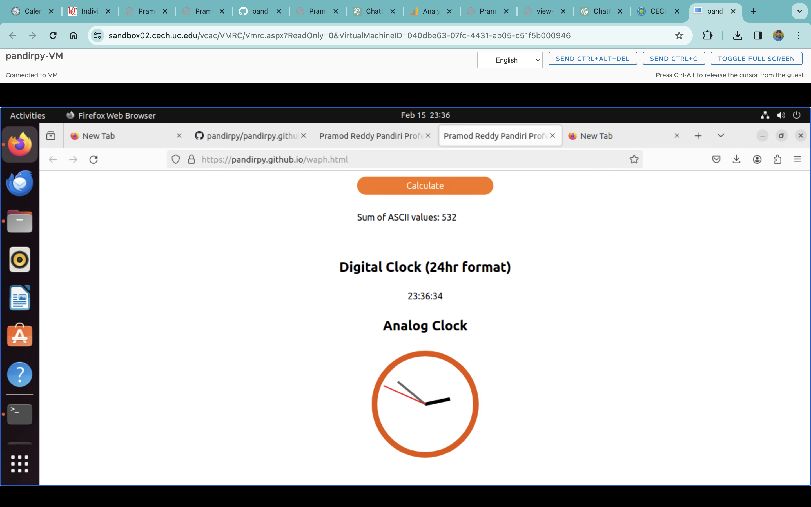

# Web Application Programming and Hacking

## Instructor : Dr Phu Phung

## Student
**Name** : Pramod Reddy Pandiri

**Email** : pandirpy@mail.uc.edu

**Short bio** : I am an ardent programmer, I am interesed in software development, Machine learning.


# Individual Project 1

This is project is about creating a pofessional portfolio including my eduaction, experience, job, skills and other details. you can view my portfolio at below provided link.

[My Portfolio](https://pandirpy.github.io/index.html)

[Repositoy URL](https://github.com/pandirpy/pandirpy.github.io)


A link to this course page ```https://github.com/pandirpy/pandirpy.github.io/waph.html``` was provided in my education section in portfolio , you can see screenshot for reference.

```
<p class=""><a href="/waph.html" target="_blank"><span class="text-white">Course: </span><span class="text-blue-500">Web Programmong and Ethical Hacking.</span> </a></p>
                                
```


### Non-technical requirements (20 pts)​
Use an open-source CSS template or framework such as Bootstrap​

 I have used tailwind css to style all the page. To use tailwing you can use cdn link or install tailwind in your folder. I have used cdn 
 ```
 <script src="https://cdn.tailwindcss.com"></script>
 ```
Target this profile for your potential employer, and your page will be graded as a part of your job application​.

I have mentioned my skills and my area of expertise according to my target employer. you can see them my portfolio and also in the screenshot.


Include a page tracker, for example: https://analytics.withgoogle.com/Links to an external site., https://flagcounter.com/

I have used google analytics here. I have creadted tracking ```G-CSD4M1Q2W3``` ID for my site as shown in screenshot.


```
<script async src="https://www.googletagmanager.com/gtag/js?id=G-CSD4M1Q2W3"></script>
            <script>
            window.dataLayer = window.dataLayer || [];
            function gtag(){dataLayer.push(arguments);}
            gtag('js', new Date());

            gtag('config', 'G-CSD4M1Q2W3');
            </script>
```


### Technical requirements (50 pts)​

Basic JavaScript code (20 pts)​
Use jQuery and one more open-source JavaScript framework/library​ to implement JavaScript code introduced in Lab 2, including, a digital clock; an analog clock; show/hide your email; and one more functionality of your choice. (5 pts each)

The course page ```waph.html``` link in linked in the main fil ```index.html```. 
In ```waph.html``` lab 2 related hands on excercises are done in different way.

HTML Code for clocks


```
 <div class="clocks flex flex-col items-center my-5 justify-between">
            <h1 class="text-2xl font-bold">Digital Clock (24hr format)</h1>
            <div class="my-3 py-3" id="digital-clock"></div>
            <h1 class="text-2xl font-bold">Analog Clock</h1>
            <canvas class="my-3 py-3" id="analog-clock" width="200" height="200"></canvas>
        </div>
```

### Digital clock 

```

    <script src="https://cdn.jsdelivr.net/momentjs/latest/moment.min.js"></script>
    
$(document).ready(function() {
            // Digital Clock
            function updateDigitalClock() {
                var now = moment().format('HH:mm:ss');
                $('#digital-clock').text(now);
            }
            setInterval(updateDigitalClock, 1000);

            
        });
```


### Analog Clock

```
<script src="https://cdn.jsdelivr.net/npm/@popperjs/core@2.5.4/dist/umd/popper.min.js"></script>
function AnalogClock() {
                var now = new Date();
                var canvas = document.getElementById('analog-clock');
                var context = canvas.getContext('2d');
                var xCenter = canvas.width / 2;
                var yCenter = canvas.height / 2;
                var radius = canvas.width / 2 - 10;
                ctx.clearRect(0, 0, canvas.width, canvas.height);
                ctx.beginPath();
                ctx.arc(xCenter, yCenter, radius, 0, 2 * Math.PI);
                ctx.lineWidth = 10;
                ctx.strokeStyle = '#E65100';
                ctx.stroke();
                var hour = now.getHours() % 12;
                var minute = now.getMinutes();
                var second = now.getSeconds();
                var hourAngle = (hour + minute / 60) * 30 * Math.PI / 180;
                var minuteAngle = (minute + second / 60) * 6 * Math.PI / 180;
                var secondAngle = second * 6 * Math.PI / 180;
                // Hour hand
                context.beginPath();
                context.moveTo(xCenter, yCenter);
                context.lineTo(xCenter + Math.cos(hourAngle) * (radius * 0.5), centerY + Math.sin(hourAngle) * (radius * 0.5));
                context.lineWidth = 6;
                context.strokeStyle = '#000000';
                context.stroke();
                // Minute hand
                context.beginPath();
                context.moveTo(xCenter, yCenter);
                context.lineTo(xCenter + Math.cos(minuteAngle) * (radius * 0.7), yCenter + Math.sin(minuteAngle) * (radius * 0.7));
                context.lineWidth = 4;
                context.strokeStyle = '#666';
                context.stroke();
                // Second hand
                context.beginPath();
                context.moveTo(xCenter, yCenter);
                context.lineTo(xCenter + Math.cos(secondAngle) * (radius * 0.9), yCenter + Math.sin(secondAngle) * (radius * 0.9));
                context.lineWidth = 2;
                context.strokeStyle = 'red';
                context.stroke();
            }
            
            setInterval(AnalogClock, 1000);
```
Two public Web APIs integration (20 pts)​

Integrate the jokeAPI (https://v2.jokeapi.dev/joke/AnyLinks to an external site., similar to Lab 2.2.d.i) with Any category of joke to display a new joke in your page every 1 minute

As I have already used api with programommg and single part, now I took chance to use diffrent parameters in api. I used two-part joke type with dark humor as genre and excluding some type of jokes.

HTML code

```
<div class="p-10">
            <span class="text-xl font-bold"> Joke API intergration with programming and dark humor, tow part (set up and delivery)</span>
            <div class="joke p-4 " id="jokeContainer">

            </div>
        </div>
```

JS Code

```
setInterval(function(){
    $.get('https://v2.jokeapi.dev/joke/Programming,Dark,Spooky?blacklistFlags=religious,racist,sexist&type=twopart', function(result) {
                // Handle the response
                $('#jokeContainer').html('Set Up: ' + result.setup +" <br> Delivery : "+ result.delivery);
            });

  }, 60000)
```


Integrate a public API with graphics. Examples: https://xkcd.com/info.0.jsonLinks to an external site., https://www.weatherbit.ioLinks to an external site..

I have used weatherbitapi to get the details of cincinnati location.

I have put the information in the graph format as shown in screeenshot.

HTML Code

```
<div style="text-align:center;" class="w-8/12">
                <h1>Using a Weather API</h1>
                <h3>Weather in Cincinnati</h3>
                <canvas id="weather-chart" width="400" height="200"></canvas>
        </div>
```

JS Code:

```
 <script src="https://cdn.jsdelivr.net/npm/chart.js"></script>
fetch('https://api.weatherbit.io/v2.0/current?city=Cincinnati&key=77d23fcb983748e6a7ead6e8ebf34531')
    .then(response => response.json())
    .then(data => {
        const weatherData = {
        labels: ['Temperature', 'Feels Like', 'Wind Speed'],
        datasets: [{
            label: '',
            data: [data.data[0].temp, data.data[0].app_temp, data.data[0].wind_spd],
            backgroundColor: ['rgba(255, 99, 132, 0.2)', 'rgba(54, 162, 235, 0.2)', 'rgba(255, 206, 86, 0.2)'],
            borderColor: ['rgba(255, 99, 132, 1)', 'rgba(54, 162, 235, 1)', 'rgba(255, 206, 86, 1)'],
            borderWidth: 1
        }]
        };

    const weatherChart = new Chart(document.getElementById('weather-chart'), {
      type: 'bar',
      data: weatherData,
      options: {
        scales: {
          y: {
            beginAtZero: true
          }
        }
      }
    });
  });
```

Use JavaScript cookies to remember the client (10 pts): If first-time visit, display a message "Welcome to my homepage!", otherwise, display a message "Welcome back! Your last visit was 'the date/time of last visit"


To implement this functionality , I have first used multiple function to maintain modularity. this functionality includes setting cookies if visting for the first or updaing cookie with the number of visits and visited time. Finally display a messge on page with welcome message.

HTML Code:
```
<div class="welcome-banner text-center">
           
                <div id="welcome-banner" class="text-center text-xl font-semibold"></div>
            
          </div>
```

```

function setCookie(name, value, days) {
            var expires = "";
            if (days) {
                var date = new Date();
                date.setTime(date.getTime() + (days * 24 * 60 * 60 * 1000));
                expires = "; expires=" + date.toUTCString();
            }
            document.cookie = name + "=" + value + expires + "; path=/";
        }

        function getCookie(name) {
            var nameEQ = name + "=";
            var ca = document.cookie.split(';');
            for (var i = 0; i < ca.length; i++) {
                var c = ca[i];
                while (c.charAt(0) == ' ') {
                    c = c.substring(1, c.length);
                }
                if (c.indexOf(nameEQ) == 0) {
                    return c.substring(nameEQ.length, c.length);
                }
            }
            return null;
        }

        function cookieExists(name) {
            return document.cookie.split(';').some((item) => item.trim().startsWith(name + '='));
        }

        function displayWelcomeBanner() {
            var visits = 1;
            var lastVisit = "";
            if (cookieExists("visits")) {
                visits = parseInt(getCookie("visits")) + 1;
                lastVisit = getCookie("lastVisit");
            } else {
                var currentDate = new Date().toLocaleString();
                setCookie("visits", visits, 365);
                setCookie("lastVisit", currentDate, 365);
                document.getElementById("welcome-banner").innerHTML = "Welcome to my homepage!";
                return;
            }
            var currentDate = new Date().toLocaleString();
            setCookie("visits", visits, 365);
            setCookie("lastVisit", currentDate, 365);
            var message = "Welcome back! Your last visit was " + lastVisit;
            document.getElementById("welcome-banner").innerHTML = message;
        }

        window.onload = displayWelcomeBanner;
        
```








